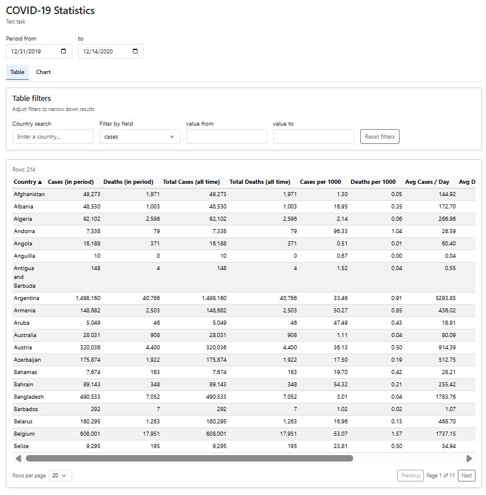
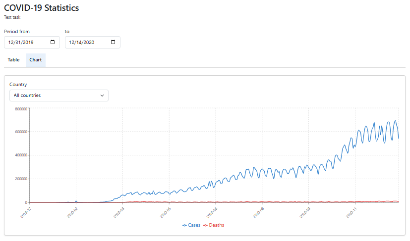

# COVID-19 Statistics Dashboard

**Language / Valoda / Язык:** [English](#english) | [Русский](#russian) | [Latviesu](#latviesu)

## English

### Overview

React + TypeScript + Vite dashboard for global COVID-19 stats from the European Centre for Disease Prevention and Control (ECDC). Filter by period and metrics, switch between a sortable table and a time-series chart, and compare countries at a glance.

### Screenshots

- Table view  
  
- Chart view  
  

### GIF

- Table gif  
  
- Chart gif  
  

### Features

- Date range filter (auto-bounded by min/max from API) drives both table aggregation and chart series.
- Country search plus numeric range filters for `cases`, `deaths`, `casesPer1000`, and `deathsPer1000`.
- View switcher: Table or Chart; reset button to clear all filters in one click.
- Table: per-country aggregation, sorting, pagination, totals (period and all time), per-1k rates, avg/max per day metrics.
- Chart: responsive Recharts line chart of daily cases and deaths with optional country selector (all countries or one).

### Metrics and Aggregations

- `casesPer1000` / `deathsPer1000`: total cases/deaths for the selected date range divided by population and multiplied by 1,000 (population from API payload).
- Avg per day: sum of cases/deaths in the selected range divided by the number of days in range.
- Max per day: maximum single-day cases/deaths within the selected range.
- "All time" columns: totals across the full dataset, independent of the selected date range.

### How to Use

- Dates default to the API min/max; changing either instantly updates table and chart.
- Table defaults: countries sorted A<>Z; page size 20 rows (configurable in UI if exposed).
- Reset filters returns dates, country search, and numeric ranges to defaults.
- View toggle switches Table <-> Chart; both honor the active date range.
- Chart country selector: empty = aggregated across all countries; pick a country to view only its series.

### Quickstart

- Requirements: Node.js 18+, modern Chrome/Firefox/Edge.
- Install deps: `npm install`
- Dev server: `npm run dev` (Vite default at http://localhost:5173)
- Production build: `npm run build`
- Preview production build locally: `npm run preview`
- Lint: `npm run lint`

### Tech Stack

- React 19.2.3, TypeScript 5.9.3 , Vite 7.3.0
- Recharts for charts 3.6.0
- Bootstrap 5.3.8 for layout/styling

### Data Source and Refresh

- Endpoint: `https://opendata.ecdc.europa.eu/covid19/casedistribution/json/`
- Data is fetched live on app start; no local snapshots or caching.
- If the API shape or URL changes, update `src/services/covidApi.ts`, adjust types in `src/types`, and align the proxy in `vite.config.ts` if needed.

### API Proxy (Dev)

- Dev proxy: `/api/ecdc` -> `https://opendata.ecdc.europa.eu` (see `vite.config.ts`), matching fetch path `/api/ecdc/covid19/casedistribution/json/` in `src/services/covidApi.ts`.
- Production: either call the upstream URL directly or serve behind a reverse proxy that rewrites `/api/ecdc/*` to the upstream to avoid CORS.
- If you change the proxy path, keep `vite.config.ts` and `src/services/covidApi.ts` in sync.

### Assignment Coverage

| Requirement                                                                  | Status | Notes                                                                                                     |
| ---------------------------------------------------------------------------- | ------ | --------------------------------------------------------------------------------------------------------- |
| Fetch data from ECDC API                                                     | Done   | Live fetch via `/api/ecdc` dev proxy to `https://opendata.ecdc.europa.eu/covid19/casedistribution/json/`. |
| Date range filter with API min/max defaults + "Show full range" shortcut     | Done   | Date inputs are bounded; shortcut button appears when the range differs from defaults.                    |
| Country search + numeric range filters + validation + reset                  | Done   | Search by country, numeric min/max per field with invalid-state styling, reset clears everything.         |
| View toggle (Table <-> Chart)                                                | Done   | Tabs switch the view while retaining shared filters.                                                      |
| Table view: aggregation, sorting, pagination, adjustable page size           | Done   | Per-country aggregation, sortable columns, pagination with 10/20/50 rows per page.                        |
| Table metrics: period totals, all-time totals, per-1k rates, avg/max per day | Done   | All required columns plus derived metrics scoped to the selected period.                                  |
| Chart view: daily cases/deaths lines + country selector                      | Done   | Recharts time series honors date range; dropdown filters to a specific country or all.                    |
| Responsive layout and UX touches                                             | Done   | Bootstrap grid, table responsiveness, validation hints; no offline caching/persistence.                   |

### Project Structure

- `src/components` - UI pieces (filters, table, chart, view tabs, shared states)
- `src/services` - API layer (ECDC fetch)
- `src/utils` - aggregation, date, and series helpers
- `src/types` - TypeScript models for API and derived data
- `/public` - static assets

### Key Files

- `src/App.tsx` - top-level page: fetches data, manages filters, toggles views
- `src/components/CovidTable.tsx` - table view and pagination
- `src/components/CovidChart.tsx` - time-series chart and country selector
- `src/components/FiltersBar.tsx` - date range, country search, numeric range filters, reset
- `vite.config.ts` - Vite config with the `/api/ecdc` dev proxy

### Limitations

- No offline mode; depends on live ECDC availability.
- No persistence beyond in-memory state during a session.
- Styling is Bootstrap-based, not a bespoke design system.

### Troubleshooting

- CORS when calling the API directly: use the dev proxy (`npm run dev`) or a proxy in production.
- Install issues: remove `node_modules`, run `npm cache clean --force`, then `npm install`.
- Data stops loading: verify the ECDC URL and update fetch URL/proxy/types if the upstream API changed.

---

## Русский

### Обзор

Приложение на React + TypeScript + Vite для глобальной статистики COVID-19 от Европейского центра по профилактике и контролю заболеваний (ECDC). Фильтрация по периоду и метрикам, переключение между сортируемой таблицей и временным графиком, наглядное сравнение стран.

### Скриншоты

- Вид таблицы  
  
- Вид графика  
  

### GIF

- GIF таблицы  
  
- GIF графика  
  

### Возможности

- Фильтр диапазона дат (автоматически ограничен min/max из API) управляет агрегацией таблицы и сериями графика.
- Поиск по стране плюс числовые фильтры для `cases`, `deaths`, `casesPer1000` и `deathsPer1000`.
- Переключатель представления: Таблица или График; кнопка сброса очищает все фильтры одним кликом.
- Таблица: агрегация по странам, сортировка, пагинация, итоги (за период и за всё время), показатели на 1 000, средние/максимальные значения в день.
- График: адаптивный линейный график Recharts ежедневных случаев и смертей с опциональным выбором страны (все страны или одна).

### Метрики и агрегации

- `casesPer1000` / `deathsPer1000`: общее число случаев/смертей за выбранный период, делённое на численность населения и умноженное на 1 000 (население берётся из данных API).
- Среднее в день: сумма случаев/смертей в выбранном диапазоне, делённая на количество дней в диапазоне.
- Максимум в день: максимальное значение случаев/смертей за один день в пределах выбранного диапазона.
- Колонки «За всё время»: итоги по всему набору данных, не зависят от выбранного диапазона дат.

### Как пользоваться

- Даты по умолчанию равны min/max из API; изменение любой из них мгновенно обновляет таблицу и график.
- Настройки таблицы по умолчанию: страны отсортированы A–Z; размер страницы — 20 строк (можно сделать настраиваемым в UI).
- Сброс фильтров возвращает даты, поиск по стране и числовые диапазоны к значениям по умолчанию.
- Переключатель вида меняет Таблица <-> График; оба режима учитывают активный диапазон дат.
- Выбор страны на графике: пусто = агрегировано по всем странам; выберите страну, чтобы видеть только её серию.

### Быстрый старт

- Требования: Node.js 18+, современный Chrome/Firefox/Edge.
- Установка зависимостей: `npm install`
- Dev-сервер: `npm run dev` (Vite по умолчанию на http://localhost:5173)
- Продакшн-сборка: `npm run build`
- Локальный предпросмотр продакшн-сборки: `npm run preview`
- Линтинг: `npm run lint`

### Технологический стек

- React 19.2.3 , TypeScript 5.9.3, Vite 7.3.0
- Recharts 3.6.0 для графиков
- Bootstrap 5.3.8 для вёрстки и стилей

### Источник данных и обновление

- Endpoint: `https://opendata.ecdc.europa.eu/covid19/casedistribution/json/`
- Данные загружаются в реальном времени при запуске приложения; локальных снапшотов или кэша нет.
- Если изменится форма данных или URL API, обновите `src/services/covidApi.ts`, типы в `src/types` и при необходимости прокси в `vite.config.ts`.

### API-прокси (Dev)

- Dev-прокси: `/api/ecdc` -> `https://opendata.ecdc.europa.eu` (см. `vite.config.ts`), соответствует пути запроса `/api/ecdc/covid19/casedistribution/json/` в `src/services/covidApi.ts`.
- Продакшн: либо вызывать upstream-URL напрямую, либо использовать обратный прокси, который переписывает `/api/ecdc/*` в upstream, чтобы избежать CORS.
- Если меняете путь прокси, держите `vite.config.ts` и `src/services/covidApi.ts` синхронизированными.

### Покрытие задания

| Требование                                            | Статус   | Примечания                                                                                                          |
| ----------------------------------------------------- | -------- | ------------------------------------------------------------------------------------------------------------------- |
| Загрузка данных из ECDC API                           | Сделано  | Живой fetch `https://opendata.ecdc.europa.eu/covid19/casedistribution/json/` через dev-прокси `/api/ecdc`.          |
| Табличный вид с сортировкой, пагинацией, итогами      | Сделано  | Агрегация по странам, сортировка, пагинация, итоги за период/все время, показатели на 1k, средние/максимумы в день. |
| График                                                | Сделано  | Recharts line chart по дневным случаям/смертям; учитывает диапазон дат и выбор страны.                              |
| Фильтр дат (min/max из API по умолчанию)              | Сделано  | Изменение даты сразу обновляет таблицу и график.                                                                    |
| Поиск по стране и числовые фильтры + сброс            | Сделано  | Поиск по стране и диапазоны для cases/deaths/per 1k; кнопка сброса очищает все фильтры.                             |
| Переключение видов (Таблица ↔ График)                 | Сделано  | Вкладки управляют отображением, фильтры общие.                                                                      |
| Дополнительно: средние/максимумы в день, адаптивность | Сделано  | Колонки avg/max в день, вёрстка на Bootstrap.                                                                       |
| Валидация/UX                                          | Частично | Даты ограничены min/max API; числовые поля ожидают числа (без отдельного UI ошибок).                                |

### Структура проекта

- `src/components` - UI-компоненты (фильтры, таблица, график, вкладки вида, общее состояние)
- `src/services` - слой API (загрузка данных ECDC)
- `src/utils` - хелперы агрегации, дат и серий
- `src/types` — модели TypeScript для API и производных данных
- `/public` — статические ресурсы

### Ключевые файлы

- `src/App.tsx` — верхнеуровневая страница: загрузка данных, управление фильтрами, переключение видов
- `src/components/CovidTable.tsx` — табличный вид и пагинация
- `src/components/CovidChart.tsx` — временной график и выбор страны
- `src/components/FiltersBar.tsx` — диапазон дат, поиск по стране, числовые фильтры, сброс
- `vite.config.ts` — конфигурация Vite с dev-прокси `/api/ecdc`

### Ограничения

- Нет офлайн-режима; зависит от доступности ECDC.
- Нет сохранения состояния между сессиями (только в памяти).
- Стили основаны на Bootstrap, без собственной дизайн-системы.

### Устранение неполадок

- CORS при прямом вызове API: используйте dev-прокси (`npm run dev`) или прокси в продакшне.
- Проблемы с установкой: удалите `node_modules`, выполните `npm cache clean --force`, затем `npm install`.
- Данные перестали загружаться: проверьте URL ECDC и обновите URL запроса/прокси/типы, если upstream-API изменился.

---

## Latviešu

### Pārskats

React + TypeScript + Vite informācijas panelis globālajai COVID-19 statistikai no Eiropas Slimību profilakses un kontroles centra (ECDC). Filtrēšana pēc perioda un metrikām, pārslēgšanās starp kārtojamu tabulu un laika rindas grafiku, kā arī valstu salīdzināšana vienā skatā.

### Ekrānuzņēmumi

- Tabulas skats  
  
- Grafika skats  
  

### GIF

- Tabulas GIF  
  
- Grafika GIF  
  

### Iespējas

- Datumu diapazona filtrs (automātiski ierobežots ar API min/max) ietekmē gan tabulas agregāciju, gan grafika sērijas.
- Valstu meklēšana un skaitliskie filtri `cases`, `deaths`, `casesPer1000` un `deathsPer1000`.
- Skata pārslēdzējs: Tabula vai Grafiks; atiestatīšanas poga notīra visus filtrus ar vienu klikšķi.
- Tabula: agregācija pa valstīm, kārtošana, lapošana, kopsummas (par periodu un par visu laiku), rādītāji uz 1 000, vidējās/maksimālās dienas vērtības.
- Grafiks: adaptīvs Recharts līniju grafiks ar dienas saslimšanas un nāves gadījumu datiem, ar izvēles valsts selektoru (visas valstis vai viena).

### Metrikas un agregācijas

- `casesPer1000` / `deathsPer1000`: kopējais saslimšanas/nāves gadījumu skaits izvēlētajā periodā, dalīts ar iedzīvotāju skaitu un reizināts ar 1 000 (iedzīvotāju skaits no API datiem).
- Vidēji dienā: gadījumu/nāves gadījumu summa izvēlētajā diapazonā, dalīta ar dienu skaitu diapazonā.
- Maksimums dienā: maksimālais vienas dienas gadījumu/nāves gadījumu skaits izvēlētajā diapazonā.
- Kolonnas “Par visu laiku”: kopsummas visam datu kopumam, neatkarīgi no izvēlētā datumu diapazona.

### Kā lietot

- Datumi pēc noklusējuma ir API min/max; jebkuras izmaiņas nekavējoties atjauno tabulu un grafiku.
- Tabulas noklusējuma iestatījumi: valstis sakārtotas A–Z; lapas izmērs — 20 rindas (ja UI to atļauj, var konfigurēt).
- Filtru atiestatīšana atgriež datumus, valstu meklēšanu un skaitliskos diapazonus uz noklusējuma vērtībām.
- Skata pārslēgšana maina Tabula <-> Grafiks; abi skati ievēro aktīvo datumu diapazonu.
- Grafika valsts selektors: tukšs = agregēts pa visām valstīm; izvēloties valsti, tiek rādīta tikai tās sērija.

### Ātrais starts

- Prasības: Node.js 18+, mūsdienīgs Chrome/Firefox/Edge.
- Atkarību instalēšana: `npm install`
- Dev serveris: `npm run dev` (Vite pēc noklusējuma http://localhost:5173)
- Produkcijas būve: `npm run build`
- Produkcijas būves lokāls priekšskatījums: `npm run preview`
- Lintēšana: `npm run lint`

### Tehnoloģiju steks

- React 19.2.3, TypeScript 5.9.3, Vite 7.3.0
- Recharts 3.6.0 grafikiem
- Bootstrap 5.3.8 izkārtojumam un stiliem

### Datu avots un atjaunināšana

- Endpoint: `https://opendata.ecdc.europa.eu/covid19/casedistribution/json/`
- Dati tiek ielādēti tiešsaistē lietotnes startā; nav lokālu momentuzņēmumu vai kešošanas.
- Ja mainās API struktūra vai URL, atjaunojiet `src/services/covidApi.ts`, tipus mapē `src/types` un, ja nepieciešams, proksi `vite.config.ts`.

### API proksi (Dev)

- Dev proksi: `/api/ecdc` -> `https://opendata.ecdc.europa.eu` (skat. `vite.config.ts`), atbilst pieprasījuma ceļam `/api/ecdc/covid19/casedistribution/json/` failā `src/services/covidApi.ts`.
- Produkcija: vai nu izsaukt upstream URL tieši, vai izmantot reverso proksi, kas pārraksta `/api/ecdc/*` uz upstream, lai izvairītos no CORS.
- Ja maināt proksi ceļu, saskaņojiet `vite.config.ts` un `src/services/covidApi.ts`.

### Uzdevuma izpilde

| Prasiba                                                | Statuss   | Piezimes                                                                                                       |
| ------------------------------------------------------ | --------- | -------------------------------------------------------------------------------------------------------------- |
| Datu ielade no ECDC API                                | Izpildīts | Dzivs fetch `https://opendata.ecdc.europa.eu/covid19/casedistribution/json/` caur dev proksi `/api/ecdc`.      |
| Tabulas skats ar kartsosanu, lapošanu, kopsummām       | Izpildīts | Aprekini pa valstim, kartsosana, laposana, kopsummas periodam un visam laikam, rādītāji uz 1k, vid./max dienā. |
| Grafiks                                                | Izpildīts | Recharts līniju grafiks pa dienām; ievēro datumu diapazonu un valsts izvēli.                                   |
| Datumu filtrs (API min/max pēc noklusējuma)            | Izpildīts | Datumu maiņa uzreiz atjauno tabulu un grafiku.                                                                 |
| Valstu meklēšana un skaitliskie filtri + atiestatīšana | Izpildīts | Meklēšana pa valstīm un diapazoni cases/deaths/per 1k; reset poga attīra visus filtrus.                        |
| Skata pārslēgšana (Tabula ↔ Grafiks)                   | Izpildīts | Cilnes pārslēdz skatu, filtri ir kopīgi.                                                                       |
| Papildu: vid./maks. dienā, responsīva vides            | Izpildīts | Kolonnas vid./max dienā, Bootstrap responsīvs izkārtojums.                                                     |
| Validācija/UX                                          | Daļēji    | Datumi ierobežoti ar min/max no API; skaitliskie lauki sagaida skaitļus (bez atsevišķa kļūdu UI).              |

### Projekta struktūra

- `src/components` — UI komponentes (filtri, tabula, grafiks, skata cilnes, kopīgais stāvoklis)
- `src/services` — API slānis (ECDC datu ielāde)
- `src/utils` — agregācijas, datumu un sēriju palīgfunkcijas
- `src/types` — TypeScript modeļi API un atvasinātajiem datiem
- `/public` — statiskie resursi

### Galvenie faili

- `src/App.tsx` — augšējā līmeņa lapa: datu ielāde, filtru pārvaldība, skatu pārslēgšana
- `src/components/CovidTable.tsx` — tabulas skats un lapošana
- `src/components/CovidChart.tsx` — laika rindas grafiks un valsts izvēle
- `src/components/FiltersBar.tsx` — datumu diapazons, valstu meklēšana, skaitliskie filtri, atiestatīšana
- `vite.config.ts` — Vite konfigurācija ar `/api/ecdc` dev proksi

### Ierobežojumi

- Nav bezsaistes režīma; atkarīgs no ECDC pieejamības.
- Nav stāvokļa saglabāšanas starp sesijām (tikai atmiņā).
- Stili balstīti uz Bootstrap, nevis pielāgotu dizaina sistēmu.

### Problēmu novēršana

- CORS, izsaucot API tieši: izmantojiet dev proksi (`npm run dev`) vai proksi produkcijā.
- Instalācijas problēmas: izdzēsiet `node_modules`, izpildiet `npm cache clean --force`, pēc tam `npm install`.
- Dati vairs netiek ielādēti: pārbaudiet ECDC URL un atjaunojiet pieprasījuma URL/proksi/tipus, ja upstream API ir mainījies.
